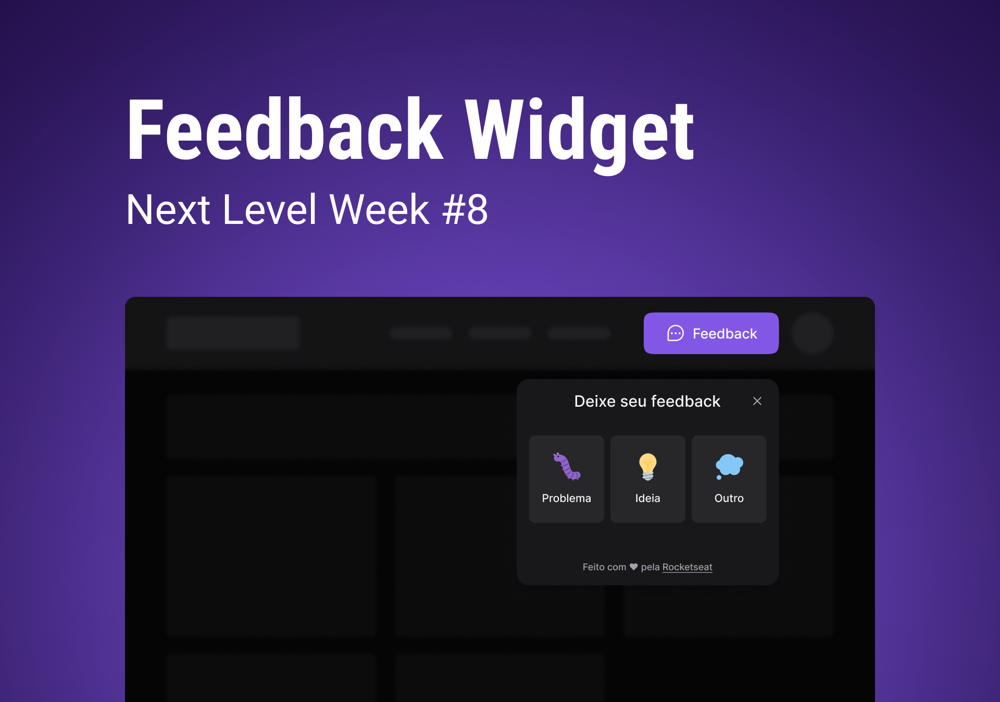

# nlw-return-web

## 💻 Project
The project consists of a feedback widget where the user can submit ideas, problems or other of the application. He can also submit a screenshot of the exact moment of the bug or other.

## ⚛ Technologies
- [ ] React
- [ ] TypeScript
- [ ] Vite
- [ ] Tailwind CSS
- [ ] Headless UI
- [ ] Axios
- [ ] Mailtrap

## 🛠 Features
- [ ] Responsive widget
- [ ] Screenshot with JavaScript
- [ ] E-mail submission

## 📑 License
This project is under the MIT License.
